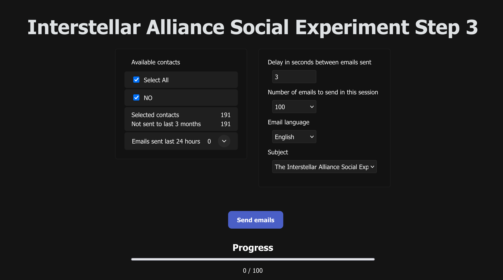
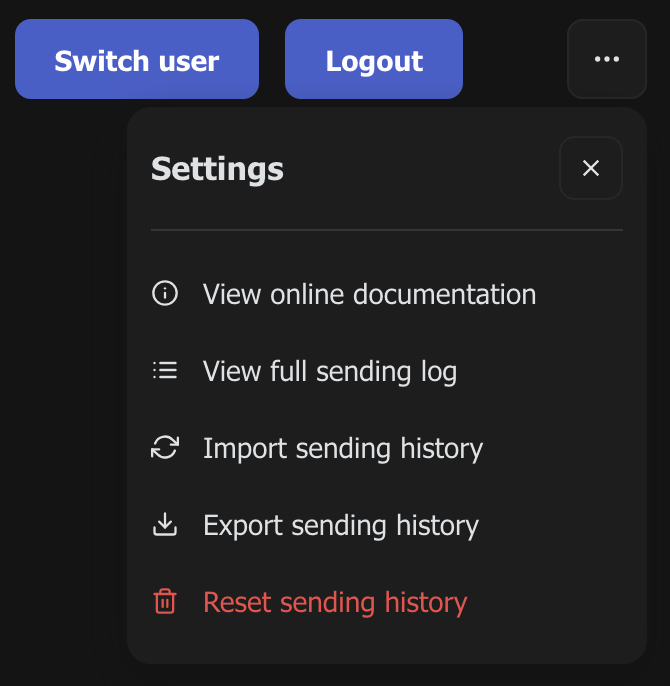

## 🛸✨🌀 Web App documentation

The **Interstellar Alliance Social Experiment Step 3 web app** is an open-source platform designed to empower individuals and organizations to efficiently send advocacy emails to relevant decision-makers, researchers, and leaders. Its primary purpose is to streamline the process of civic engagement by providing curated contact lists tailored to the user's country or institution, ensuring that messages reach the appropriate recipients. The web app emphasizes privacy, ease of use, and responsible communication, making it simple for users to participate in campaigns, track their sending history, and manage their sending history across devices.

<br/>

### 📧 Starting a Sending Session

Most email providers have a daily limit on the number of emails you can send. These limits are set to prevent spam and protect users from abuse. If you exceed these limits, you may be temporarily blocked from sending more emails.

- **Google (Gmail, Google Workspace):**
  - Regular Gmail accounts: up to **500 emails per day**
  - Google Workspace (business/education): up to **2,000 emails per day**

    <br/>

- **Microsoft (Outlook.com, Office 365):**
  - Free personal accounts: limit is not officially published, but is widely reported to be around **300 emails per day** (may vary based on account reputation and usage)
  - Enterprise/organization accounts: up to **10,000 recipients per day** (limits may vary by organization)
  - See the note and link below for more details

**Tips:**

- Spread your sending over several days to avoid exceeding the daily limit.
- Start low, but 100 emails a day should be fine.
- If you reach your provider’s daily limit, you must wait 24 hours before you can send more emails.
- If you repeatedly exceed the daily limit your account might get blocked.

For the most up-to-date information, refer to your provider’s official documentation:

- [Google sending limits](https://support.google.com/mail/answer/22839?hl=en)
- [Microsoft sending limits](https://support.microsoft.com/en-us/office/sending-limits-in-outlook-com-279ee200-594c-40f0-9ec8-bb6af7735c2e)

_Note: Microsoft does not officially publish the exact daily sending limit for free Outlook.com accounts. The limit is widely reported to be around 300 emails per day, but may vary based on account reputation and usage history._

<br/>

To start a sending session, select a contact list available for your country and click the **Send emails** button.



<br/>

### 📒 Contact Lists

Only contact lists relevant to your country code are shown. This helps ensure you send messages to representatives or institutions where you have voting rights or direct influence.

**Contact lists currently available:**

```
Brazil - parliament (senate and chamber of deputies)
         plus the most relevant cabinet members and their departments

Canada - parliament (senate and house of commons)
         (includes members of the cabinet)

EU     - parliament and commissioners

France - parliament (senate amd national assembly)

Italy  - parliament (senate and chamber of deputies)
         Italian translation of the Step 3 letter is available

Mexico - parliament (senate and chamber of deputies)

Norway - parliament and cabinet
         the king and military operations headquarters
         Norwegian translation of the Step 3 letter is available

UK     - parliament (house of commons and house of lords)

Note that members without a personal official email have been omitted
```

<br/>

### 🔄 Exporting and Importing Sending History

If you switch to another browser or computer, use the export/import feature (found in the menu by clicking the three dots in the upper right corner) to transfer your sending history. Export your history from your current device, then import it on your new device.



**Tip:** After finishing your sending for the current 3-month period, create a backup and store it in a safe place. This way, you can restore your history if you switch devices later.

**The import feature is designed to handle:**

- Importing to a clean state (no emails sent yet on the device)—this is the most reliable option.
- Importing after already sending emails from the device.
- Importing the same file multiple times without losing or duplicating your sending history.

**Not supported:**

- Sending from two different computers without always keeping them in sync by exporting/importing before each sending session. This is not recommended, as it’s easy to forget the export/import step.

<br/>

_Note: Backups are password protected to ensure the integrity of the backup._
